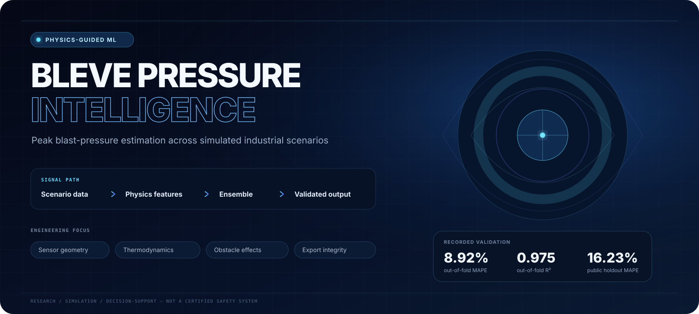
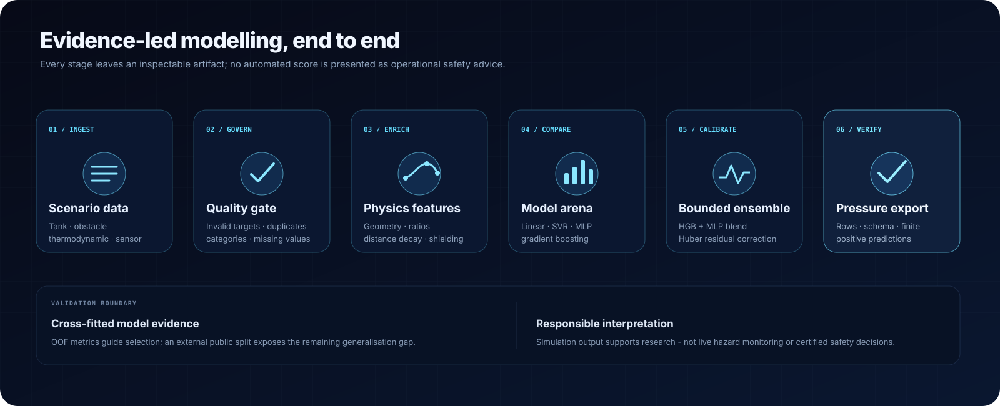
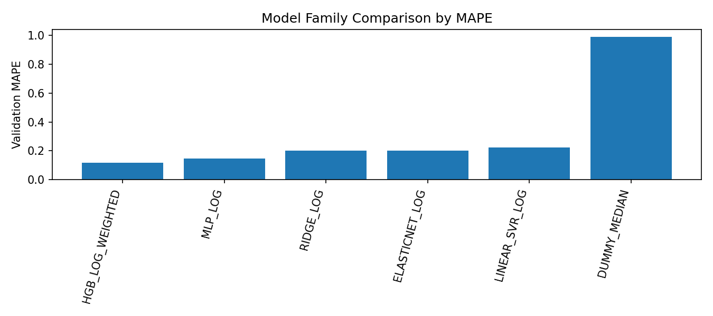
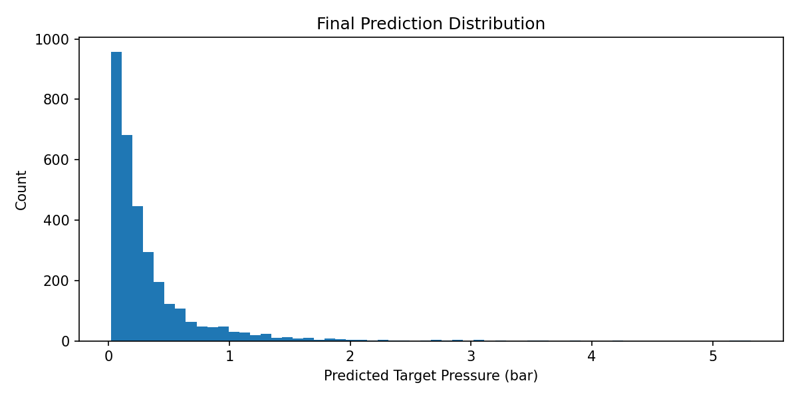

<p align="center">
  
</p>

<p align="center">
  <a href="https://github.com/Himath2002/bleve-pressure-intelligence/actions/workflows/quality.yml"></a>
  
  
  <a href="LICENSE"></a>
</p>

<p align="center">
  <strong>An end-to-end machine-learning workflow for estimating peak pressure across simulated Boiling Liquid Expanding Vapour Explosion scenarios.</strong>
</p>

BLEVE Pressure Intelligence turns tank, thermodynamic, obstacle, and sensor
geometry records into contract-checked pressure estimates. The system combines
transparent data-quality controls, physics-guided feature construction,
cross-validated model comparison, a HistGradientBoosting + MLP ensemble, and
bounded Huber residual calibration.

> [!IMPORTANT]
> This is a research and simulation system—not a live pressure monitor, a
> certified engineering model, or a substitute for validated process-safety
> analysis. Its predictions must not drive emergency, plant, or regulatory
> decisions.

## At a glance

| Evidence | Result | Meaning |
| --- | ---: | --- |
| Raw training scenarios | 10,050 | Source records before quality controls |
| Model-ready scenarios | 9,990 | 10 invalid-target rows and 50 exact duplicates removed |
| Unlabelled prediction scenarios | 3,203 | Every row passed the final export contract |
| Out-of-fold MAPE | **8.92%** | Cross-validated model-selection evidence |
| Out-of-fold R² | **0.975** | Cross-validated explained variance |
| Public holdout MAPE | **16.23%** | External evidence showing a real generalisation gap |

The local and public results are intentionally reported together. The stronger
out-of-fold score is useful for model development; the weaker public holdout
score is the more conservative signal that distribution shift and selection
optimism remain.

## System workflow

<p align="center">
  
</p>

1. **Ingest** — load structured simulation scenarios and separate identifiers,
   inputs, and target pressure.
2. **Govern** — audit missingness, invalid targets, duplicates, range anomalies,
   and inconsistent state labels before training.
3. **Enrich** — construct interpretable tank, thermodynamic, obstacle, and
   sensor-distance features without mutating the source records.
4. **Compare** — evaluate distinct baselines and nonlinear model families under
   a shared cross-validation protocol.
5. **Calibrate** — blend complementary HGB and MLP signals, then apply a small,
   bounded residual correction fitted out of fold.
6. **Verify** — reject exports with missing identifiers, the wrong row count,
   non-finite values, duplicates, or non-positive pressure estimates.

## Engineering decisions

### Data quality before model complexity

The pipeline does not silently discard every incomplete record. It removes only
rows that cannot support supervised learning—a missing, non-finite, or
non-positive target—and exact duplicates that could bias validation. Numeric
and categorical feature gaps are handled inside model pipelines, preventing
preprocessing leakage across folds.

Known casing and spelling variants in the thermodynamic status field are
normalised to stable `Superheated`, `Subcooled`, and `missing` values. Extreme
pressure observations remain available to the model because a rare value is not
automatically an error in a hazard-simulation dataset.

### Physics-guided feature space

The reusable feature package derives signals that give the models more useful
structure while keeping their interpretation visible:

| Feature family | Examples | Modelling purpose |
| --- | --- | --- |
| Tank geometry | volume, footprint, surface proxy, aspect ratios | Represent source size and shape |
| Liquid and vapour state | fill fraction, vapour fraction, height and volume proxies | Describe material distribution inside the tank |
| Sensor geometry | 3D distance, vertical offset, inverse-distance terms | Represent spatial pressure decay |
| Obstacle interaction | projected area, shielding proxy, source-to-obstacle distance | Describe obstruction and orientation effects |
| Thermodynamics | critical-temperature gaps, superheat, pressure ratios | Capture proximity to critical conditions |
| Categorical interactions | sensor × side × status keys | Expose layout- and state-specific behaviour |

Safe denominators and finite-value replacement protect ratio features from
division instability. Temperature fields use observed-scale checks because the
source column labels and recorded values do not always express units
consistently.

### Model arena, not a single favourite algorithm

Every family is evaluated under the same target-aware fold allocation and the
same four metrics. Linear models and SVR establish interpretable reference
points; nonlinear candidates test whether geometry and thermodynamics interact
in ways those baselines cannot express.

| Model family | Representative model | OOF MAPE | OOF R² |
| --- | --- | ---: | ---: |
| Gradient-boosted trees | HistGradientBoosting | 0.1161 | 0.9362 |
| Neural network | MLPRegressor | 0.1474 | 0.9173 |
| Regularised linear | Ridge | 0.2011 | 0.8404 |
| Regularised linear | ElasticNet | 0.2022 | 0.8417 |
| Support-vector regression | LinearSVR | 0.2230 | -0.8299 |
| Naive baseline | DummyRegressor | 0.9904 | -0.0969 |

<p align="center">
  
</p>

### Conservative nonlinear ensemble

The selected system combines multiple HistGradientBoosting candidates with
seed-averaged MLP support. A cross-fitted bin-ratio stage and Huber residual
model correct remaining log-scale error. Shrinkage and ratio caps deliberately
limit the final adjustment so calibration cannot dominate the underlying
ensemble.

| Final-model evidence | Value |
| --- | ---: |
| Out-of-fold MAPE | **0.08919** |
| Out-of-fold R² | **0.97477** |
| Out-of-fold RMSE | **0.07860 bar** |
| Out-of-fold MAE | **0.03108 bar** |
| Fold MAPE standard deviation | **0.00062** |
| Lowest-pressure decile MAPE | **0.12976** |
| Highest-pressure 1% MAPE | **0.10593** |

The regional metrics matter: MAPE can amplify small absolute errors at low
pressures, while rare high-pressure cases carry disproportionate safety
importance.

## Prediction contract

The recorded export contains exactly one strictly positive pressure estimate
for each of the 3,203 unlabelled scenario identifiers:

| Check | Recorded result |
| --- | ---: |
| Rows equal expected inputs | 3,203 / 3,203 |
| Required columns | `ID`, `Target Pressure (bar)` |
| Missing values | 0 |
| Non-positive predictions | 0 |
| Prediction range | 0.0222–5.3170 bar |

<p align="center">
  
</p>

## Repository map

```text
bleve-pressure-intelligence/
├── .github/workflows/quality.yml       # Python lint and test matrix
├── artifacts/
│   ├── figures/                        # Recorded model and data evidence
│   └── tables/                         # Machine-readable evaluation summaries
├── data/
│   ├── README.md                       # Dataset boundary and local setup
│   └── schema.csv                      # Fields, units, roles, and descriptions
├── docs/assets/                        # Repository-native technical visuals
├── notebooks/
│   └── bleve-pressure-modeling.ipynb   # Complete modelling narrative
├── scripts/
│   └── generate_demo_data.py           # Deterministic synthetic demo generator
├── src/bleve_pressure/
│   ├── demo.py                         # Synthetic scenario and proxy-target logic
│   ├── features.py                     # Reusable physics-guided features
│   └── validation.py                   # Prediction export contract
├── tests/                              # Feature, data, notebook, and export checks
├── pyproject.toml                      # Package and tooling configuration
└── README.md
```

## Run locally

### Prerequisites

- Python **3.11+**
- A Jupyter-compatible environment for the modelling notebook

### 1. Create the environment

```bash
git clone https://github.com/Himath2002/bleve-pressure-intelligence.git
cd bleve-pressure-intelligence

python -m venv .venv
source .venv/bin/activate
python -m pip install --upgrade pip
python -m pip install ".[notebook,dev]"
```

On Windows PowerShell, activate the environment with
`.venv\Scripts\Activate.ps1`.

### 2. Choose a data path

For a safe, non-authoritative software demonstration:

```bash
python scripts/generate_demo_data.py --output-dir data/demo
export BLEVE_DATA_DIR=data/demo
```

For authorised benchmark reproduction, place the original `train.csv` and
`test.csv` under `data/`. Those files are ignored by Git. Their exact contract
is documented in [`data/schema.csv`](data/schema.csv).

### 3. Execute the notebook

```bash
jupyter lab notebooks/bleve-pressure-modeling.ipynb
```

By default, a run writes figures, evidence tables, and `prediction.csv` to
`artifacts/runs/latest/`. Set `BLEVE_ARTIFACT_DIR` to isolate another run:

```bash
export BLEVE_ARTIFACT_DIR=artifacts/runs/experiment-01
```

The notebook is intentionally compute-heavy: it compares multiple model
families, performs five-fold nonlinear candidate evaluation, averages MLP
seeds, searches blends, and cross-fits calibration.

## Verification

Run the same lightweight quality gate used by continuous integration:

```bash
python -m ruff check src tests scripts
python -m pytest
```

The checks cover:

- deterministic synthetic data generation;
- status normalisation and finite physics features;
- prediction schema, row count, uniqueness, finiteness, and positivity;
- notebook metadata and removal of personal or machine-specific paths.

The full benchmark notebook is validated separately because its source data is
intentionally not redistributed and its complete model search is unsuitable
for every pull request.

## Evidence and reproducibility boundaries

- `artifacts/tables/benchmark_summary.csv` is the compact source of recorded
  metrics used in this README.
- The committed figures and tables were produced by the full benchmark run;
  synthetic demo results will differ.
- Exact values can move slightly across supported numerical-library versions;
  the committed evidence set is kept intact with its recorded public holdout
  result rather than mixing metrics from different executions.
- Out-of-fold scores are development evidence, not an untouched deployment
  estimate: feature, model, blend, and calibration choices were informed by the
  same cross-validation framework.
- The public holdout score is included to make the observed generalisation gap
  explicit rather than hiding it.
- Raw data and generated predictions are excluded from version control because
  their redistribution rights were not supplied.

## Responsible-use limitations

- The records describe simulated scenarios, not calibrated live sensors.
- Coverage outside the observed geometry, material, and pressure ranges is
  unknown.
- MAPE is unstable near zero and must be interpreted beside absolute-error and
  pressure-region metrics.
- HistGradientBoosting and MLP models capture nonlinear interactions but do not
  provide a mechanistic explosion model.
- Any operational extension requires independent data provenance, uncertainty
  quantification, external validation, monitoring, and review by qualified
  process-safety professionals.

## Author and licence

Designed and engineered by **Himath Ahangama**.

The source code is available under the [MIT License](LICENSE). That licence
does not grant rights to third-party or privately supplied datasets; the
benchmark CSVs remain outside this repository.
